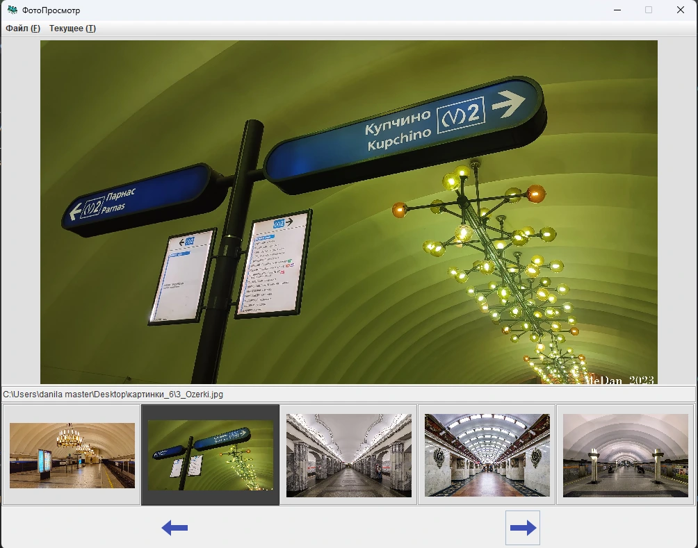
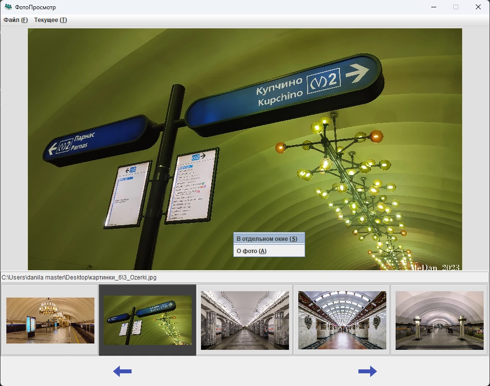
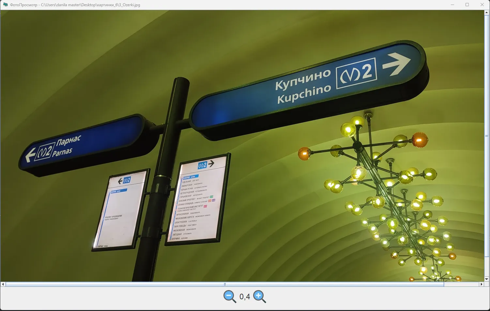

<h1>Применяемые разделы Java</h1>
<ul>
  <li>Collections</li>
  <li>I/O</li>
  <li>Exeptions</li>
  <li>Time</li>
  <li>Lambda Expressions</li>
  <li>Swing</li>
  <li>Annotations</li>
  <li>Maven</li>
</ul>

<h1>ПО при разработке</h1>
<ul>
  <li>ОС Windows 10 22h2</li>
  <li>IDE - IntelliJ Idea CE 2025</li>
  <li>JDK 2025 <a href="https://download.oracle.com/java/25/latest/jdk-25_windows-x64_bin.msi">скачать</a></li>
</ul>

<h1>Быстрый просмотр возможностей приложений</h1>

В репозитории представлен код нескольких приложений. Для быстрого просмотра возможностей, предоставляемых этими приложениями, добавлен каталог <a href="jars">jars</a>.

В него помещены исполняемые jar-файлы приложений, которые можно запустить имея на ПК установленное ПО Java (JRE/JDK). Если приложение не запускается, возможна неполная установка Java (например отсутвие в перменной среды Path значения с папкой bin от Java) или устаревшая версия установленного JRE/JDK.

<h1>Описание приложений</h1>
<h2>"ФотоПросмотр"</h2>
<ul>
  <li>код - <a href="ch11/src/main/java/testing/PhotoViewer">ch11/src/main/java/testing/PhotoViewer</a></li>
  <li>jar - <a href="jars/PhotoViewer.jar">jars/PhotoViewer.jar</a></li>
</ul>

Представляет собой средство просмотра изображений форматов png, jpg, jpeg, присутсвующий в выбранном каталоге. На главном экране изображено: 
<ul>
  <li>
    текущее изображение большим планом, пять соседних изображений в виде панели из пяти малых изображений
  </li>
  <li>
    строка полного имени файла с изображением
  </li>
  <li>
    кнопки переключения на следующее/предыдущее изображение
  </li>
  <li>
    строка меню, с помощью которой можно прекратить работу приложения, выбрать текущую папку, переключить текущее фото в отдельное окно и получить инфрмацию о текущем изображении
  </li>
  <li>
    всплывающее меню на области изображения, позволяющее переключить в отдельное окно и получить информацию о изображении
  </li>
</ul>

Дейсвия экранных кнопок продублированы нажатиями клавиш клавиатуры и кнопок мыши: на главном экрае можно пользоваться мнемониками строки меню и правой/левой стрелкой. В отдельном окне нажимать +/-, ПКМ/ЛКМ для зума

Пример главного окна на выбранной лиректории

Всплывающее меню с выбором перехода в отдельное окно

Изображение в отдельном окне с коэффициентом увеличения 0.4

<h2>Калькулятор</h2>
<ul>
  <li>код - <a href="ch11/src/main/java/testing/Calculator.java">ch11/src/main/java/testing/Calculator.java</a></li>
  <li>jar - <a href="jars/Calculator.jar">jars/Calculator.jar</a></li>
</ul>

Представляет собой калькулятор, позволяющий:
 
<ul>
  <li>
    Вычилсять значения арифметических выражений содержащих операции: сложения, вычитания, целогисленного деления и умножения над целыми числами.
  </li>
  <li>
    Выбирать систему счисления, в которую приводится результат: 2, 8, 10 и 16.
  </li>
</ul> 

Выражения могут содержать знаки операций и цифры. Длина выражения ограничена сорока символами. Результат появляется при нажатии кнопки "=". На экране присутсвует панель с 16-ю кнопками, "дисплеем" в верхней строке выражени, в нижней - результат.

Управление приложением, в том числе выбор системы счисления осуществляется через строку меню в верху окна

Пример вычисления

Выбор двоичной системы счисления

Пример расчета с учетом двоичной системы счиления

**Пятнашка 3*3**

**Дизайн строки**

