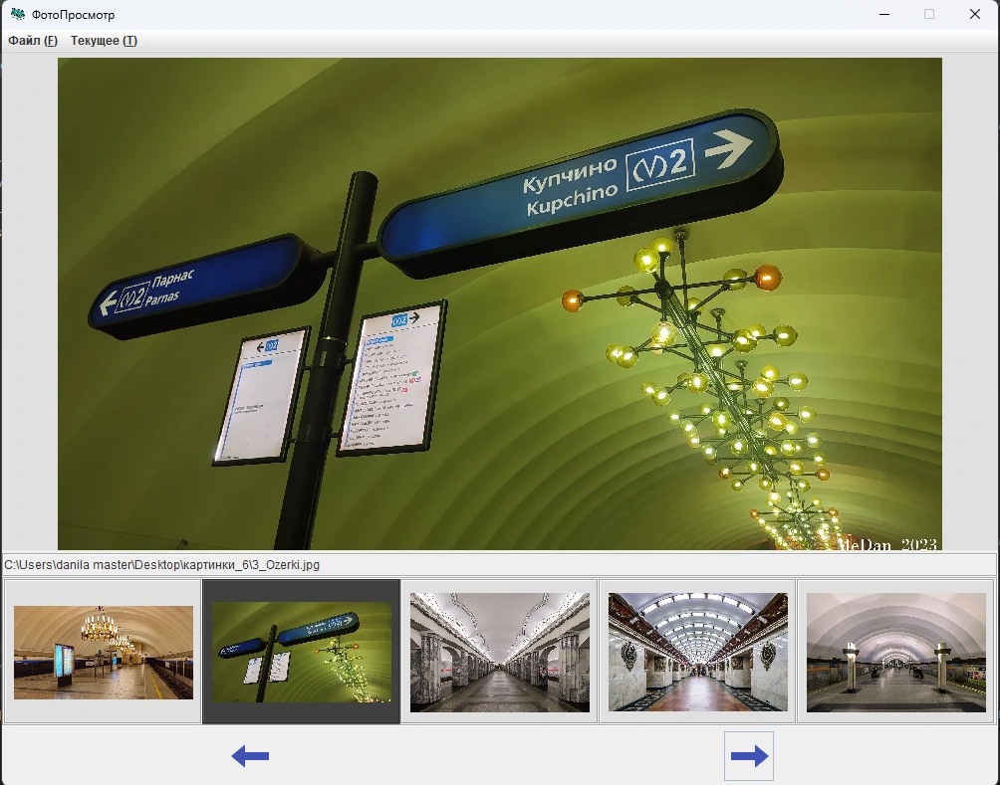
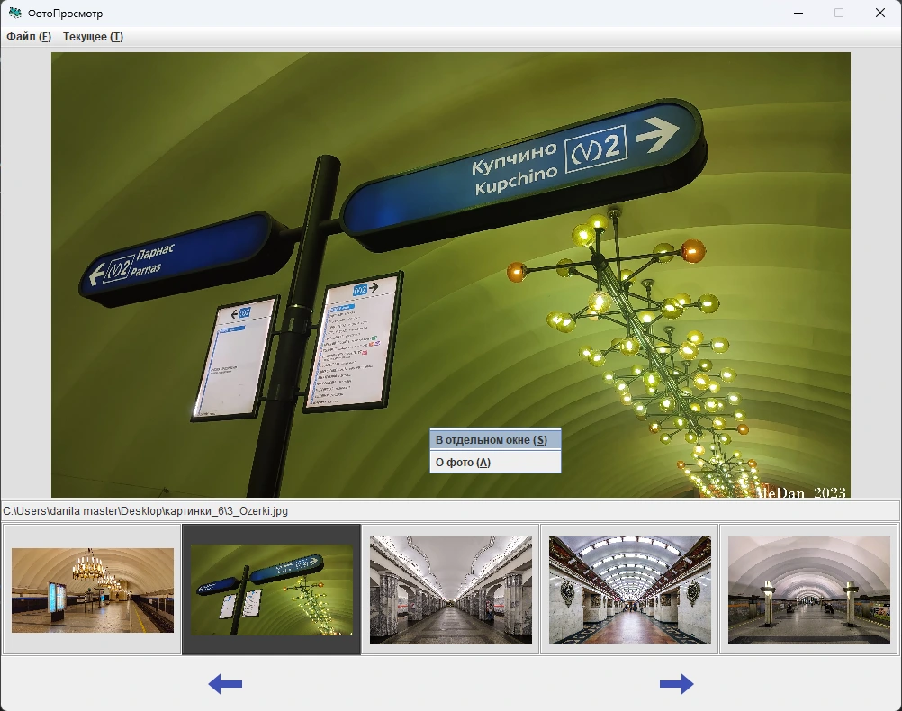
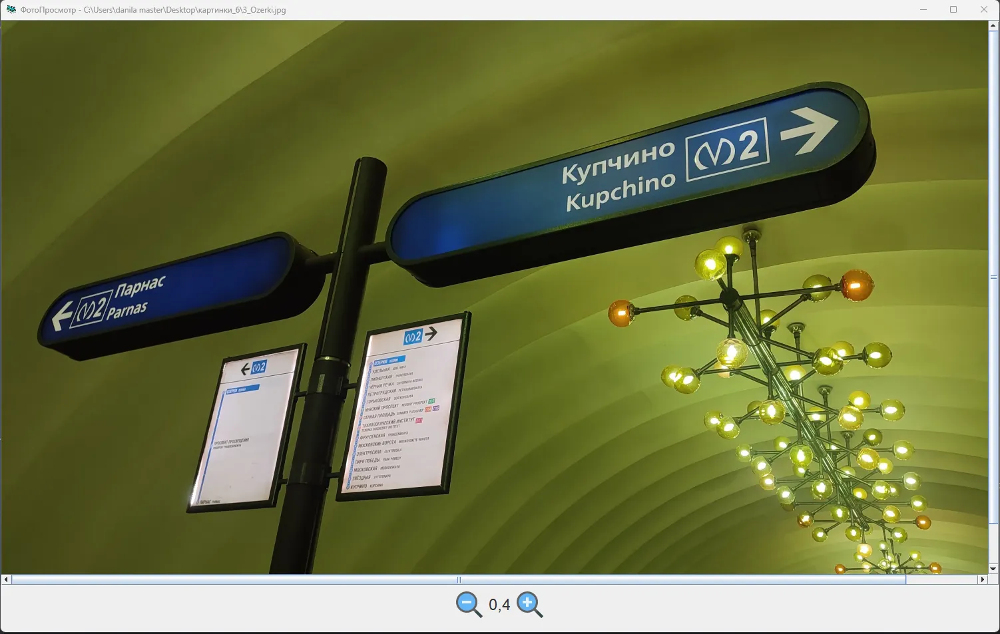

<h1>Применённые разделы Java</h1>
<ul>
  <li>Collections</li>
  <li>I/O</li>
  <li>Exeptions</li>
  <li>Lambda Expressions</li>
  <li>Swing</li>
  <li>Annotations</li>
  <li>Maven</li>
</ul>

<h1>Применённые паттерны проектирования</h1>
<ul>
  <li>Мост</li>
  <li>Фасад</li>
  <li>Компоновщик</li>
  <li>Наблюдатель</li>
  <li>Одиночка</li>
</ul>

<h1>ПО при разработке</h1>
<ul>
  <li>ОС Windows 10 22h2</li>
  <li>IDE - IntelliJ Idea CE 2025</li>
  <li>JDK 2025 <a href="https://download.oracle.com/java/25/latest/jdk-25_windows-x64_bin.msi">скачать</a></li>
</ul>

<h1>Быстрый просмотр возможностей приложений</h1>

Для быстрого просмотра возможностей, предоставляемых приложением, можно запустить <a href="ImageViewer.jar">jar-файл</a> из корня репозитория.

<h1>Описание приложения</h1>
<h2>"ФотоПросмотр"</h2>

Представляет собой средство просмотра изображений форматов png, jpg, jpeg, присутсвующий в выбранном каталоге. На главном экране изображено: 
<ul>
  <li>
    текущее изображение большим планом, пять соседних изображений в виде панели из пяти малых изображений
  </li>
  <li>
    строка полного имени файла с изображением
  </li>
  <li>
    кнопки переключения на следующее/предыдущее изображение
  </li>
  <li>
    строка меню, с помощью которой можно прекратить работу приложения, выбрать текущую папку, переключить текущее фото в отдельное окно и получить инфрмацию о текущем изображении
  </li>
  <li>
    всплывающее меню на области изображения, позволяющее переключить в отдельное окно и получить информацию о изображении
  </li>
</ul>

Дейсвия экранных кнопок продублированы нажатиями клавиш клавиатуры и кнопок мыши: на главном экрае можно пользоваться мнемониками строки меню и правой/левой стрелкой. В отдельном окне нажимать +/-, ПКМ/ЛКМ для зума

Пример главного окна на выбранной лиректории

Всплывающее меню с выбором перехода в отдельное окно

Изображение в отдельном окне с коэффициентом увеличения 0.4

